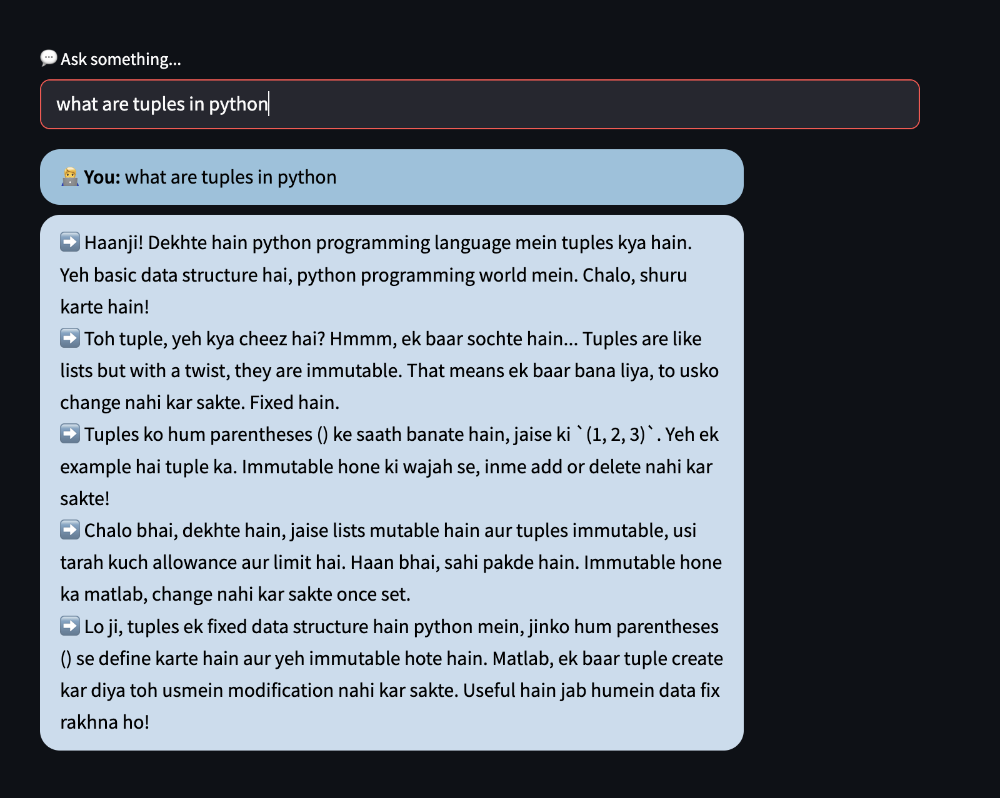

## Chain of thought with Persona prompting

## Prerequisites
1. Python 3.12.6 or higher
2. uv (Python virtual environment): `pip install uv`

## Installation
1. Set up a Python virtual environment: `python -m venv venv`
2. Activate the virtual environment: `source venv/bin/activate`
3. Install the required packages with uv: `uv sync`
4. Run fastapi
```fastapi dev main.py```
5. Run Streamlit
```streamlit run chat_ui.py```


